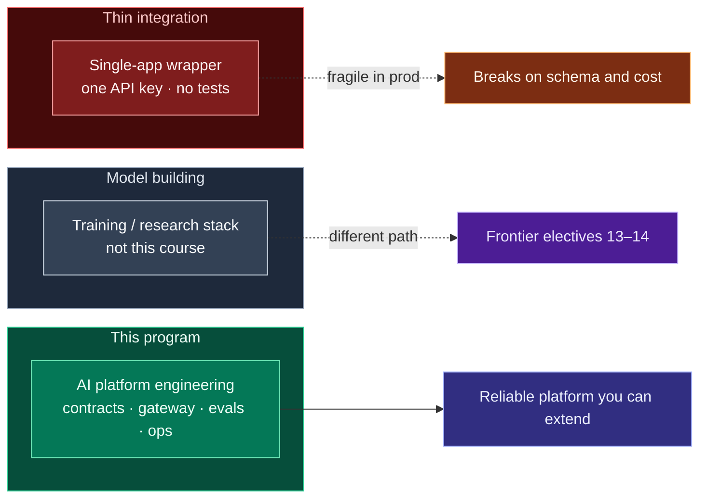
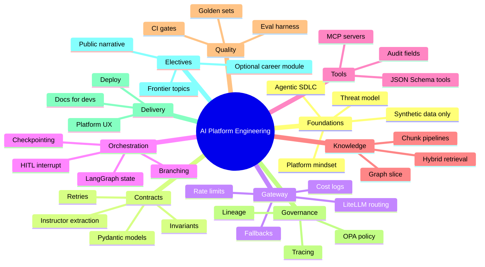
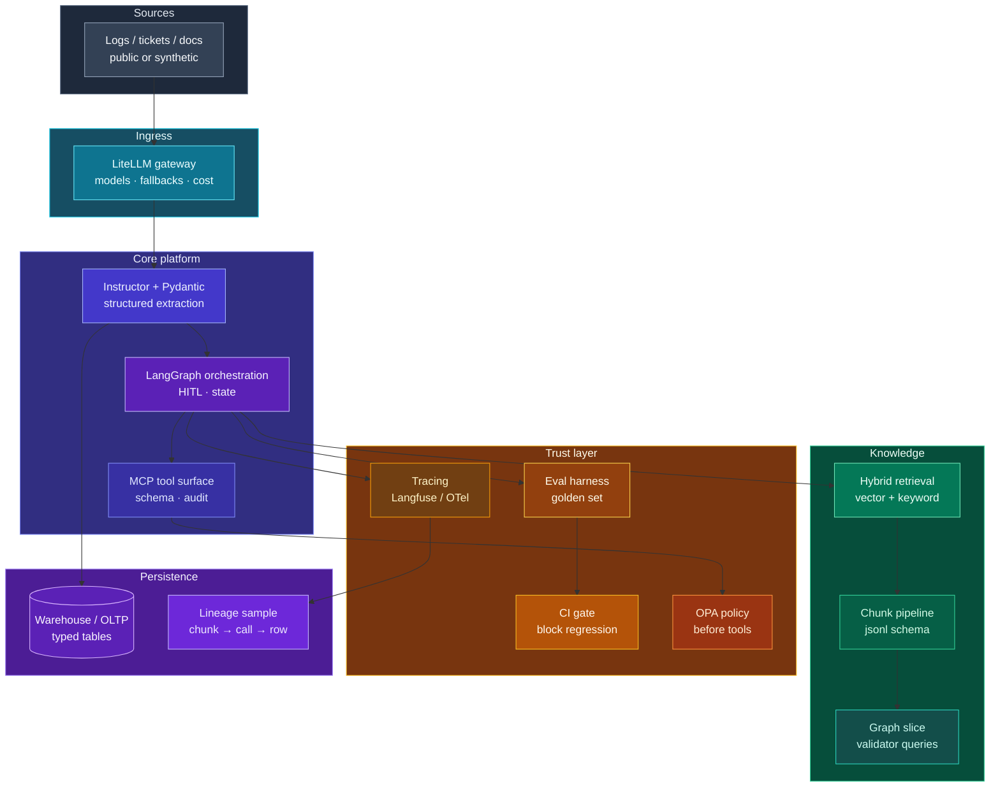

# AI Platform & Systems Engineering — Program Brief

**Read this before Course 0.** If you have spent years moving data through warehouses, orchestrators, and APIs, this brief explains how **AI platform engineering** extends that work—not replaces it—and how **16 courses (0–15)** assemble into one system you can run, test, and operate. LLM mechanics, RAG, and agents appear **in context** as you add each layer; they are not the opening chapter.

| | |
| --- | --- |
| **In this studio** | **Course sidebar** (topics & prove lines) · **Course overview** (map, glossary, checklist) · **Lab & Prove** on each topic |
| **Who it is for** | Data, analytics, and platform engineers who ship production pipelines and want to **design and run LLM/agent platforms** |
| **Pace** | ~15 months · 10–15 hours/week (self-paced) |
| **What you leave with** | One **end-to-end AI platform** on public or synthetic data: gateway, contracts, orchestration, tools, retrieval, eval gates, policy, traces, deploy |

## Start here in 60 seconds

1. **Daily driver** — topics in the studio sidebar (not this whole brief every day).
2. **Every topic** — **Theory → Foundations** first, then **Lecture / Reading**, then Lab & Prove.
3. **Course 0** — schemas & extraction; **Course 1** — transformers *at intuition level* (Karpathy + 3Blue1Brown) + LiteLLM gateway.
4. **Strategy once** — skim phases and reference architecture below; depth lives in Master Plan §17.
5. **Optional model math/code** — [`OPTIONAL_MODEL_DEPTH.md`](./OPTIONAL_MODEL_DEPTH.md) (not required for prove gates).

## Contents

1. [What you are signing up for](#1-what-you-are-signing-up-for)  
2. [What is AI platform / systems engineering?](#2-what-is-ai-platform--ai-systems-engineering)  
3. [Who this is for & prerequisites](#3-who-this-is-for--prerequisites)  
4. [Pacing while employed](#4-pacing-while-employed)  
5. [What problems it solves](#5-what-problems-does-ai-platform-engineering-solve)  
6. [Program mindmap & phases](#6-program-mindmap-domains-and-order)  
7. [Reference architecture](#7-reference-architecture-what-you-are-building-toward)  
8. [Learning studio layout](#8-how-the-learning-studio-works)  
9. [Artifact ladder (courses 0–15)](#9-what-you-build-over-15-months-artifact-ladder)  
10. [Course encyclopedia (skills depth)](#10-course-by-course-coverage-detailed)  
11. [Reading order](#11-suggested-reading-order-before-you-touch-llm-lecture)  
12. [Success criteria](#12-success-criteria-how-you-know-the-platform-is-real)  
13. [Data & security boundaries](#13-data--security-boundaries)  
14. [Glossary & stack substitutions](#14-glossary--stack-substitutions)  
15. [Document maintenance](#15-document-maintenance)

### Prerequisites

| You should already be comfortable with | You do **not** need |
| --- | --- |
| Python 3.11+, git, code review culture | Training foundation models from scratch |
| Building or operating **data pipelines** or **backend APIs** | A prior job title of “ML engineer” |
| Unit tests, CI, idempotent jobs | Transformer math proofs |
| Reading cloud/IAM docs at a practitioner level | A paid MOOC subscription |
| ~**5 years** shipping data/platform software (or equivalent depth) | Completing every optional video in the track |

---

## 1. What you are signing up for

Picture your week as a data engineer: a product team wants “AI on our logs/docs.” Someone wires ChatGPT to a script; JSON shape changes every deploy; nobody knows token spend; the demo works until real data hits. You have seen this movie—**missing contracts, missing tests, missing lineage**—just with a model in the middle.

This program is the **opposite of a demo script**. It is a **universal, course-by-course build** of the platform layer teams actually need: force structured outputs, route models safely, run agent workflows with human checkpoints, expose tools with audit, index knowledge with benchmarks, block bad releases with eval CI, and trace what happened end to end. You implement it once, in one repo, the same way you would grow a internal data platform—**incremental milestones, each with a prove artifact** (release, test suite, benchmark table, policy test, deploy note).

**How it is organized**

- **Courses 0–15** are months of scope, not vanity certificates. Each course adds a **capability** to the same capstone codebase.
- The **learning studio** (this repo’s app) is the syllabus UI: theory at three depths, lectures/links, lab steps with real OSS references, and checklists. Progress is yours; **Prove** means “show the artifact,” not “watched the video.”
- **Course 0** is a short boot on **typed extraction** (messy text → validated records). That is deliberate: you start where data engineers already live—**schemas and tests**—then widen into gateway, agents, retrieval, and governance.

**What you are not signing up for**

| Skip this expectation | What we do instead |
| --- | --- |
| Learn prompts in isolation | Learn **contracts, gateways, and harnesses** that make prompts one small input |
| Collect random framework repos | Follow one **architecture spine**; frameworks are interchangeable details |
| Train or research foundation models | **Operate** models via APIs; depth is integration and reliability |
| Begin with three months of transformer math | Get a **platform map** first; deep LLM theory is tied to Courses 0–1 when you need it |
| Pay for MOOCs | Free docs, videos, and OSS implementations are enough if you do the proves |

**What “done” feels like**

You can walk someone through your repo—from raw-ish input to stored, typed output—and point to **where** you validate, **where** you route models, **where** tools are allowed, **where** retrieval is measured, and **where** CI would stop a bad change. That is the universal skill this course sells: **AI platform engineering as engineered systems**, not as magic strings.

---

## 2. What is AI platform / AI systems engineering?

**AI platform engineering** is the discipline of running **LLM and agent workloads as production software**: APIs, data contracts, orchestration, retrieval, cost controls, security, testing, and observability—so other teams can build features **without** every app reinventing the same fragile glue.

Think of an LLM as an **untrusted compute kernel**: fast and flexible, but nondeterministic, opaque, and unsafe to wire directly to databases or tools without guards.

| Layer | Platform engineer owns | Typical data-engineer analogy |
| --- | --- | --- |
| **Ingress** | Auth, rate limits, request IDs, PII classification | API gateway + landing zone |
| **Contract** | Pydantic schemas, validation, retries | Schema registry + Great Expectations on a row |
| **Routing** | Multi-model proxy, fallbacks, budgets | Job router / queue priority |
| **Orchestration** | State machines, HITL, checkpointing | Airflow / Dagster with human approval steps |
| **Tools** | MCP or internal tool APIs, audit logs | Stored procedures + access logs |
| **Knowledge** | Chunking, hybrid search, grounding | Bronze/silver indexing pipelines |
| **Quality** | Golden sets, eval CI, regression gates | DQ tests blocking merge |
| **Policy** | OPA / RBAC before tool execution | Row-level security + IAM |
| **Observability** | Traces, cost per request, attribution | Pipeline lineage + SLA dashboards |
| **Delivery** | Deploy, runbooks, platform docs for devs | Platform team “golden path” |

**AI systems engineering** emphasizes **end-to-end behavior**: what happens from a user or batch job request through model calls, tool calls, retrieval, persistence, and audit—not a single notebook cell.

### How this course sits in the landscape



---

## 3. Who this is for & prerequisites

### Data engineers (primary lens)

You already solve problems that **production AI cannot skip**:

1. **Messy inputs → trusted tables** — Logs, PDFs, tickets, and events need parsing, typing, and DQ before anyone trusts a dashboard. LLM extraction is the same class of problem with a noisier engine.
2. **Idempotency and reconciliation** — You know duplicate keys and balance checks. Agent platforms need the same **invariant checks** before writes.
3. **Lineage** — “Which upstream file produced this metric?” becomes “which chunk and which model call produced this field?”
4. **Cost and capacity** — Warehouse spend discipline translates to **token budgets**, caching, and model routing.
5. **Security and classification** — You already think about PII in pipelines; LLM calls need **data-classification gates** before text leaves the VPC.
6. **Testing culture** — pytest, CI, and fixture data are how you prove a platform change is safe—exactly what **eval harnesses** are for LLM features.

Roughly **most production AI work** is still **data and platform**: ingestion, indexing, schema enforcement, batch + online paths, and governance—not tuning attention heads.

### Skills you reuse vs skills you add

| You already have | You will add in this program |
| --- | --- |
| Python, git, SQL, pipelines | Instructor/Pydantic **response contracts** |
| Unit tests, CI | **Golden-set evals** and regression gates |
| Airflow/MWAA-style orchestration | **LangGraph** (or equivalent) state + HITL |
| API integrations | **LiteLLM** gateway patterns |
| Data modeling | **Chunk schemas**, graph slices for GraphRAG |
| IAM, secrets patterns | **OPA**-style policy before tools |
| On-call and runbooks | **Traces** (e.g. Langfuse) and cost attribution |

You do **not** need to abandon data engineering. You **extend** it into the control plane for AI features.

### Platform & backend engineers

If your week is **services, queues, and on-call** rather than SQL-only, the same program applies: you will map ingress, routing, and policy to patterns you already use, and add **eval harnesses** and **retrieval pipelines** as new subsystems. Skip duplicate “what is git” material; lean on **Platform depth** theory and prove gates.

### Analytics & ML-adjacent engineers

If you own **metrics layers, semantic models, or experimentation**, Courses 4–9 are especially natural (retrieval quality, golden sets, CI). Course 0 still matters—**typed extraction** is how AI features land in tables you would trust.

---

## 4. Pacing while employed

| Hours/week | Realistic pace | Tips |
| --- | --- | --- |
| **10** | ~1 course / 5–6 weeks | Finish required prove lines; defer optional Watch rows. |
| **12–15** | ~1 course / month (track intent) | Batch Lab work on weekends; run eval CI during weekday PRs. |
| **20+** | Course 0 in 1–2 weeks; faster P1 | Still do prove gates—speed without artifacts is a demo, not a platform. |

**Course 0** can be a **7-day sprint** or **two weeks** beside a day job. **Courses 10–12** need larger integration blocks—plan a single “integration month” with slack.

**Advancing to “advanced”:** move from **Foundations** → **Study guide** → **Platform depth** per topic; complete **Courses 7–9** before calling retrieval/agent work “production-ready”; treat **Course 12 `v1.0`** as the baseline complete platform, **13–14** as electives on top.

---

## 5. What problems does AI platform engineering solve?

Without a platform layer, teams repeat the same failures:

| Failure mode | Symptom | Platform response (what you build) |
| --- | --- | --- |
| **Schema chaos** | JSON shape drifts every prompt tweak | `response_model` + validators + retries |
| **Silent hallucination** | Wrong fields land in DB | Golden-set evals + block merge on regression |
| **Runaway cost** | One loop burns tokens | Gateway budgets, caching, model routing |
| **Unsafe tools** | Agent deletes or exfiltrates | Policy gate + audited tool surface (MCP) |
| **No accountability** | “The model did it” | Trace IDs tying chunk → call → write |
| **RAG theater** | Vector DB without benchmarks | Hybrid retrieval + measured recall/precision table |
| **Demo-only agents** | Works in notebook, dies in prod | HITL interrupt, checkpointing, timeouts |
| **Framework churn** | Rewrite every year | Thin domain logic on thick **harness** |

The capstone story in this program is deliberately **boring in the right way**: reconciler / ops logs / public docs → typed records → workflows → tools → search → eval CI → deploy.

---

## 6. Program mindmap (domains and order)

High-level **concept map**—not the lesson order. You climb from **contracts** to **capstone**.



### Phases (how courses group)

| Phase | Courses | Theme | Prove mindset |
| --- | --- | --- | --- |
| **P0 — Boot** | 0 | Ship typed extraction fast | Public repo + metric on golden set |
| **P1 — Platform core** | 1–3 | Gateway + agents + tools | Releases, HITL demo, MCP + audit |
| **P2 — Knowledge** | 4–6 | Retrieval & documents | Benchmark tables, chunks, graph validator |
| **P3 — Trust** | 7–9 | Evals, CI, policy, traces | Golden ≥30, CI blocks bad merge, policy test |
| **P4 — Capstone** | 10–12 | Integrate, deploy, harden | `alpha` → deploy proof → `v1.0` + lineage |
| **P5 — Electives** | 13–15 | Frontier + narrative | Measured experiments, technical posts, optional career module |

**LLMs** are taught when you need them for **contracts and routing** (Courses 0–1), not as the first page of the program. **RAG** is Courses 4–6 after you can **extract and route** reliably.

### Core path vs platform extension path

Following the [GPT-6 Astra curriculum review](./audit/AI_System_Engineer_Astra_Curriculum_Review.md), the program has two labeled outcomes on the **same capstone repo**:

| Path | Audience | Calendar (10–15 h/week) | Courses | Employability focus |
| --- | --- | --- | --- | --- |
| **Core — AI systems engineer** | Ship one production LLM application with evals, policy, and deploy | ~6–8 months | **0–12** (required prove gates) | Strong portfolio app + interview narrative |
| **Platform extension** | Build the **paved road** other teams use | +3–4 months after core | **Spread across 9–13** + extension proves below | Platform / staff-level “second app onboards here” story |
| **Optional depth** | Researchy or interview polish | +2–3 months slack | **13–15** electives | Differentiation, not blockers |

**Core path** is what the sidebar order and prove checklists already enforce. **Platform extension** does not renumber courses; it adds **extra prove themes** (see gap matrix) you attach after Course 9 or during 11–13.

#### Platform extension prove checklist (portfolio add-on)

Complete **at least four** of these after core Course 12 (or weave into Courses 11–13 where noted):

- [ ] **Multi-tenant gateway** — Two logical apps share LiteLLM; different model allowlists, budgets, and rate limits; deny path emits audit event.
- [ ] **Secrets & rotation** — Provider credential rotated without app redeploy; traces redact configured sensitive fields.
- [ ] **SRE slice** — Documented SLOs; failure injection (throttle or 5xx) shows bounded retries, idempotent writes, and a simple error-budget or ops dashboard.
- [ ] **IaC deploy** — Staging (or equivalent) provisioned or updated via PR + pipeline; smoke, eval, and policy tests in pipeline; rollback steps in `DEPLOY.md`.
- [ ] **Serving economics** — One benchmark: hosted API vs self-hosted or batch endpoint on latency, throughput, and estimated cost per successful task.
- [ ] **Supply chain** — CI produces SBOM or image scan artifact; documents model/prompt/app versions in a release manifest.
- [ ] **Second app onboarded** — Minimal second service (read-only tools only) uses shared gateway, eval runner, and tracing conventions via template—not a fork of capstone internals.
- [ ] **FinOps showback** — Monthly-style report: cost by team/app/model; one tenant budget enforced without starving others.

**Graduation bar for “platform engineer” wording on your resume:** core **0–12** complete **plus** second-app onboarded **and** multi-tenant gateway **and** IaC deploy (or your staff engineer’s equivalent three).

---

## 7. Reference architecture (what you are building toward)

This is the **spine** every course extends:



ASCII equivalent (for plain-text readers):

```
Logs / docs → LiteLLM gateway → Instructor/Pydantic extraction
  → LangGraph + HITL → MCP tools + OPA → RAG + eval CI → deploy + lineage
```

**How to read the diagram:** Courses **0–3** wire ingress, contracts, orchestration, and tools. **Courses 4–6** add knowledge paths (you can stub retrieval early, but benchmarks matter in Course 4+). **Courses 7–9** harden trust. **Course 10** connects the branches; **11–12** ship and record lineage. Not every arrow is a separate microservice on day one—start as modules in one repo, split when prove gates demand it.

---

## 8. How the learning studio works

| Panel | Purpose |
| --- | --- |
| **Courses (left)** | Navigate months 0–15; tier labels P0 / P1 / P2. |
| **Topics (left-center)** | Ordered checklist per course; **START HERE** on entry topic. |
| **Content (center)** | **Theory (Foundations)** → **Lecture/Reading** → **Study guide** when easy → **Lab & Prove**. |
| **Mentor (right, optional)** | BYOK API keys for explanations—not required to learn. |

**Rules**

1. One topic at a time—finish the checkbox, not the whole channel playlist.
2. **Always start on Theory** — read **Foundations** until the ready checklist is true, then open **Lecture** or **Reading** (the video/article is Step 2, not Step 1).
3. **Prove** ends the course—paste evidence in Lab & Prove.
4. Use **Focus content** (toolbar) on small screens to hide side panels.

---

## 9. What you build over 15 months (artifact ladder)

One GitHub portfolio repo (name your choice) grows each course:

| Course | You add to the platform |
| --- | --- |
| **0** | Reconciler service: messy text → typed JSON; golden-set score in README |
| **1** | Gateway logging: model, tokens, latency, cost per request |
| **2** | LangGraph workflow around reconciler; HITL fail path |
| **3** | MCP server; tool audit log (user, tool, args hash, timestamp) |
| **4** | Hybrid retrieval benchmark table (committed, reproducible) |
| **5** | `chunks.jsonl` + chunk schema for document pipeline |
| **6** | Graph validator test + sample GraphRAG query |
| **7** | Eval harness; golden set ≥ 30 cases |
| **8** | CI job that **blocks** merge on eval regression |
| **9** | Trace export + policy test (deny dangerous tool) |
| **10** | Integrated **alpha** tag; caching proof |
| **11** | Deploy screenshot + “how to add a tool/eval” doc |
| **12** | **`v1.0`** tag + lineage artifact (chunk → call → row) |
| **13–14** | 1–2 frontier modules + public technical narrative |
| **15** | Optional system-design practice & career log |

All data **synthetic or public**—no employer secrets in the public repo.

---

## 10. Course-by-course coverage (detailed)

**Quick view:** artifact per course is in [§9](#9-what-you-build-over-15-months-artifact-ladder). Below is **skills depth** only; hours and prove lines are in the **topic checklist** for each course in the sidebar.

### Course 0 — Boot: structured extraction (foundation week)

| | |
| --- | --- |
| **Hours** | 14–28 |
| **Prove** | Public GitHub reconciler + golden-set metric |

**Covers:** Agentic SDLC (tests, README, threat model); Pydantic v2; Instructor `response_model` and retries; LiteLLM fallbacks; invariant validators on messy log-like text; pytest harness; shipping OSS.

**Platform skills:** Treat LLM output as **untrusted** until validated; first **metric** you can reproduce from README.

**LLM content here:** Short intro videos and Pydantic-for-LLM workflows—not a full transformer course yet.

---

### Course 1 — LLM foundations & deterministic I/O (month 1)

| | |
| --- | --- |
| **Hours** | 12–18 |
| **Prove** | Release `v0.2` + README metrics |

**Covers:** LLM lifecycle, context limits, failure modes; time-boxed generative-AI short courses; **required** Karpathy deep dive (transformers, KV cache, inference) + 3Blue1Brown attention intuition; LiteLLM router hardened; per-request **cost and latency** logging.

**Platform skills:** Gateway as **single front door** to models; observability baseline.

**Theory before video:** Each Course 1 topic opens on **Foundations** in the studio; optional build-from-scratch links in [`OPTIONAL_MODEL_DEPTH.md`](./OPTIONAL_MODEL_DEPTH.md).

---

### Course 2 — Agent orchestration (LangGraph) (month 2)

| | |
| --- | --- |
| **Hours** | 12–18 |
| **Prove** | HITL demo in README (validation fail → `interrupt()`) |

**Covers:** Cyclic graphs, state, branching, checkpointing; LangGraph vs ad-hoc chains; wrap reconciler in a graph; human-in-the-loop paths.

**Platform skills:** **Orchestration control plane**—not one-shot prompts.

---

### Course 3 — Tools & MCP (month 3)

| | |
| --- | --- |
| **Hours** | 12–16 |
| **Prove** | MCP server + audit log snippet |

**Covers:** Model Context Protocol; tool schemas; JSON Schema; safe tool design; audit fields; align tools with your capstone repo layout.

**Platform skills:** **Discoverable, versioned tool surface** other engineers can attach to.

---

### Course 4 — Hybrid retrieval (month 4)

| | |
| --- | --- |
| **Hours** | 10–14 |
| **Prove** | Hybrid benchmark table in repo |

**Covers:** When RAG helps vs hurts; dense + sparse retrieval; grounding and no-answer paths; reproducible benchmarks on public corpus.

**Platform skills:** Retrieval as **measured pipeline**, not “we installed a vector DB.”

---

### Course 5 — Document parsing & chunks (month 5)

| | |
| --- | --- |
| **Hours** | 10–14 |
| **Prove** | `chunks.jsonl` + schema |

**Covers:** Parsing pipelines (including modern doc parsers); chunk boundaries; metadata; schema for downstream indexers.

**Platform skills:** **Bronze-layer** for unstructured data feeding RAG.

---

### Course 6 — Graph & GraphRAG slice (month 6)

| | |
| --- | --- |
| **Hours** | 10–14 |
| **Prove** | Validator test + example query |

**Covers:** Property graph basics; when graph augments vectors; small GraphRAG slice with tests—not entire Neo4j admin arc.

**Platform skills:** **Structured relationships** alongside embeddings.

---

### Course 7 — Evaluation harness (month 7)

| | |
| --- | --- |
| **Hours** | 10–14 |
| **Prove** | Golden set ≥ 30 cases |

**Covers:** Eval design (schema vs semantic correctness); Ragas or custom metrics where appropriate; harness layout; Hamel-style eval thinking.

**Platform skills:** **Quality engineering** for nondeterministic components.

---

### Course 8 — Eval CI/CD gates (month 8)

| | |
| --- | --- |
| **Hours** | 8–12 |
| **Prove** | CI blocks regression |

**Covers:** Running evals in GitHub Actions (or equivalent); thresholds; cost/latency budgets in PR checks.

**Platform skills:** Same muscle as **DQ gates on merge**.

---

### Course 9 — Policy + observability (month 9)

| | |
| --- | --- |
| **Hours** | 10–14 |
| **Prove** | Trace sample + policy test |

**Covers:** OPA (or equivalent) before tool execution; Langfuse/OpenTelemetry-style traces; tying user/session to model and tool calls.

**Platform skills:** **Security and audit** for agentic systems.

---

### Course 10 — Capstone integration (month 10)

| | |
| --- | --- |
| **Hours** | 16–24 |
| **Prove** | Git tag `alpha` + caching proof |

**Covers:** Wire gateway, graph, MCP, retrieval, evals into one runnable demo; performance/caching where justified.

**Platform skills:** **Integration engineering**—the hard part of real platforms.

---

### Course 11 — Deploy & platform UX (month 11)

| | |
| --- | --- |
| **Hours** | 12–16 |
| **Prove** | Reproducible deploy + smoke tests + rollback + platform doc |

**Covers:** Container or PaaS deploy; health checks; post-deploy eval/policy smoke; rollback; how another dev adds a read-only tool and eval case (`docs/adding-a-tool.md`).

**Platform skills:** You are building **for other engineers**, not only for yourself.

---

### Course 12 — Lineage & hardening (month 12)

| | |
| --- | --- |
| **Hours** | 8–12 |
| **Prove** | Tag `v1.0` + lineage sample |

**Covers:** End-to-end lineage story; hardening checklist; on-call style runbook for common failures.

**Platform skills:** **Production credibility**.

---

### Course 13 — Frontier deep dive (month 13)

| | |
| --- | --- |
| **Hours** | 8–16 |
| **Prove** | README “why we added X” |

**Covers:** Pick 1–2 of: fine-tuning slice, DSPy, advanced routing, multimodal, etc.—tied to capstone, not tangent projects.

**Platform skills:** **Differentiation** without losing harness focus.

---

### Course 14 — Frontier + public narrative (month 14)

| | |
| --- | --- |
| **Hours** | 8–12 |
| **Prove** | Technical post or design doc link |

**Covers:** Architecture diagrams; metrics from evals/traces; repo polish for external readers.

**Platform skills:** **Explain the system** like a platform RFC.

---

### Course 15 — System design & optional career module (month 15)

| | |
| --- | --- |
| **Hours** | 10–20 |
| **Prove** | Design notes or private career log (optional) |

**Covers:** End-to-end platform design drills using your capstone; optional job-search tasks if you are switching roles.

**Platform skills:** **Operate and extend** the platform story under questioning.

---

## 11. Suggested reading order (before you touch “LLM lecture”)

1. **This brief** (you are here)—platform frame, mindmap, architecture.
2. **Course 0 overview** also shows the short **studio primer** (panels, rules, first hour)—same ideas as this page, lighter weight.
3. **Course 0 → START HERE** topic—first prove-sized slice of work (extraction & schemas).
4. **Course 1** LLM foundations when Course 0 prove is done or nearly done.

If you open Karpathy’s deep dive on day one, that is fine **as optional depth**—but your **graded story** is platform artifacts, not hours watched.

---

## 12. Success criteria (how you know the platform is real)

You can demonstrate, with repo links:

1. **Contract** — Show a Pydantic model and a test that fails when the model drifts.
2. **Gateway** — Show cost/latency per request and a fallback path.
3. **Orchestration** — Show a graph with HITL interrupt on validation failure.
4. **Tools** — Show MCP (or equivalent) with audit log redacted sample.
5. **Retrieval** — Show a benchmark table you can reproduce.
6. **Eval CI** — Show a PR that failed because evals regressed.
7. **Policy** — Show a denied tool call with reason.
8. **Lineage** — Show one traced path from source chunk to stored field.

---

## 13. Data & security boundaries

- Use **synthetic or public** data in the portfolio repo.
- Do not paste production credentials, customer data, or proprietary architectures into public artifacts.
- Before sending **any** real data to an external LLM API, follow your organization’s classification and vendor policy—this program practices the **gates** you would use at work (policy course) on safe data only.

---

## 14. Glossary & stack substitutions

| Term | Meaning in this program |
| --- | --- |
| **Untrusted kernel** | LLM/API call whose output must pass schema/DQ before load |
| **Prove gate** | Course exit artifact (release, CI, benchmark, policy test) |
| **Golden set** | Labeled rows used like fixture data for regression |
| **HITL** | Human-in-the-loop checkpoint (e.g. LangGraph `interrupt()`) |
| **MCP** | Standard tool surface between agents and allow-listed capabilities |
| **Harness** | Eval + CI + tracing + policy wrapped around model calls |

| Track default | Substitutions (same pattern) |
| --- | --- |
| LangGraph | Temporal, custom state machine, PydanticAI |
| LiteLLM | Corporate model gateway, Bedrock proxy, direct provider SDK + wrapper |
| OPA | Cedar, IAM conditions, custom authz middleware |
| Langfuse | OpenTelemetry + your log stack |
| Qdrant/pgvector | OpenSearch, Weaviate, managed vector store |

Studio **glossary** (course overviews) may define additional terms—see Course 0 map.

---

## 15. Document maintenance

| Change | Update |
| --- | --- |
| Syllabus topics, links, prove lines | `AI_System_Engineer_Learning_Track_2027.md` → `npm run curriculum` |
| Strategy, interview depth, §17 modules | `AI_System_Engineer_Master_Plan.md` |
| **Home / landing narrative** | This file → `program_brief_markdown` in `npm run curriculum` |
| **Doc placement map** | [`DOCUMENTATION_MAP.md`](./DOCUMENTATION_MAP.md) |

When this brief changes, note it in the PR and regenerate curriculum if the studio embeds excerpts.

---

*End of program brief. Open the studio, read Course 0 map, then start the first prove-sized topic—not “all of LLM theory” first.*
