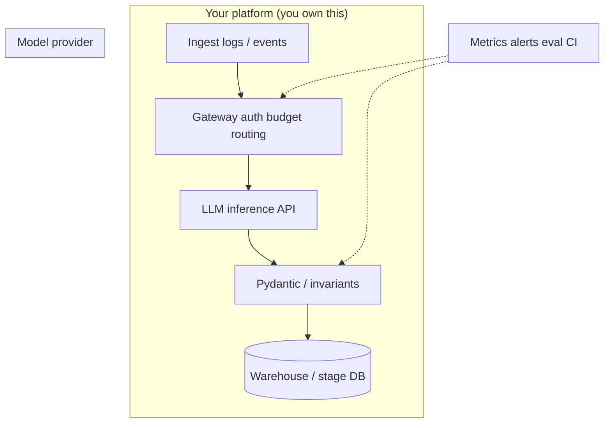
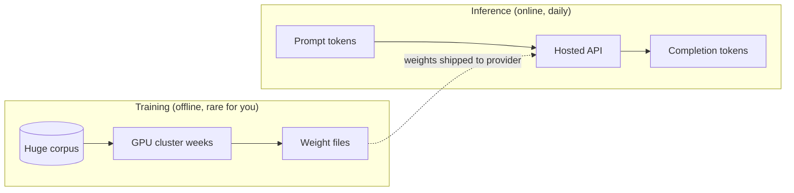
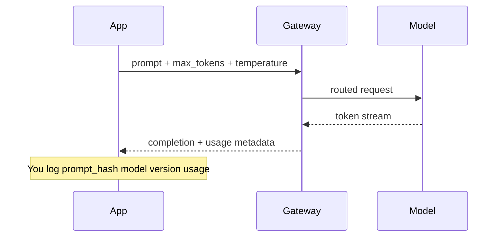
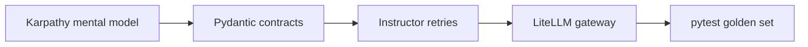

# Karpathy — Intro to LLMs

> **Visual study guide** · Course 0 boot sprint · ~1 h video · Primary: [YouTube ↗](https://www.youtube.com/watch?v=zjkBMFhNj_g)

## What you are learning

Large language models are **not databases**. They are **next-token predictors**: given a sequence of tokens, they output a probability distribution over the next token, repeatedly, until a stop condition. Your platform job is to wrap that unreliable function with **contracts, budgets, and tests**—the same way you would wrap any flaky external API.

| Concept | Plain English | Platform lever |
| --- | --- | --- |
| **Token** | Chunk of text the model reads/writes | Billing, context limits, log truncation |
| **Context window** | Max tokens in one request | Chunking, summarization, rejection |
| **Training vs inference** | Learn weights vs run weights | You almost always ship **inference** only |
| **Hallucination** | Plausible but false text | Schema validation, golden sets, HITL |
| **Temperature** | Randomness of sampling | Lower for extraction; higher for brainstorming |

## System picture: where the LLM sits

Karpathy’s talk explains what happens **inside** the `LLM` box. This track focuses on everything **around** it.

## Training vs inference (two different jobs)

- **Training** — expensive, infrequent, not your month-1 deliverable.
- **Inference** — per-request cost, latency SLOs, retries, and logging **every** call.

## Mental model: LLM as a stateless function

Treat each call as:

\[
\text{completion} = f(\text{prompt}, \text{model\_id}, \text{params})
\]

There is **no memory** between calls unless **you** persist chat history, RAG chunks, or graph state.

## While you watch (checklist)

- [ ] Sketch **training vs inference** on one page.
- [ ] Note **context window** as a hard limit—what happens when logs exceed it?
- [ ] List three reasons the model sounds **confident when wrong**.
- [ ] Write **temperature** guidance for extraction vs creative tasks.
- [ ] Identify what you will **log** per request (model id, tokens, latency, prompt hash).

## Failure modes (design for these early)

| Failure | Symptom | Mitigation |
| --- | --- | --- |
| Trusting prose | Bad data in warehouse | Pydantic + invariants + golden set |
| Huge prompts | Cost spike, timeout | Truncate, summarize, structured chunks |
| No audit trail | Cannot replay incident | Log prompt hash, model version, params |
| Unbounded retries | 10× cost on bad rows | Cap retries; fail to HITL queue |

## How this connects to boot-week prove

You are not proving you trained a model—you are proving you can **ship a bounded, testable extraction path**.

## Done when

You can draw **input → gateway → model → validated JSON → storage** and explain what you **never** trust without a schema check.

## Primary source

[Karpathy — Intro to LLMs ↗](https://www.youtube.com/watch?v=zjkBMFhNj_g) — mark this topic complete when **this video’s objectives** are met, not when you finish unrelated playlists.
