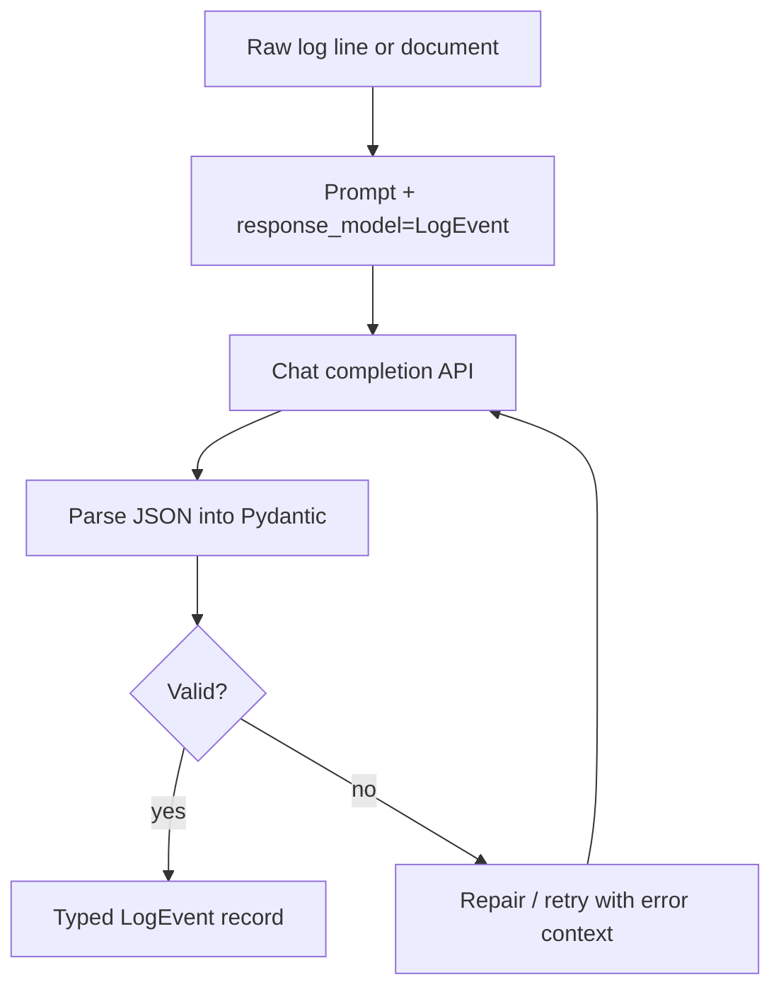
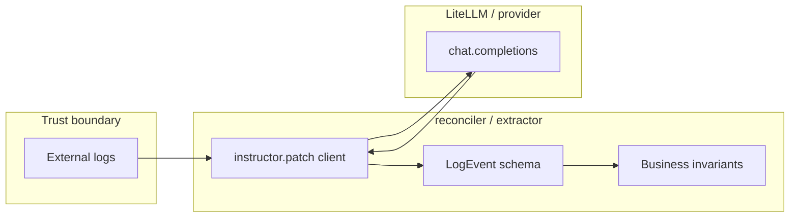
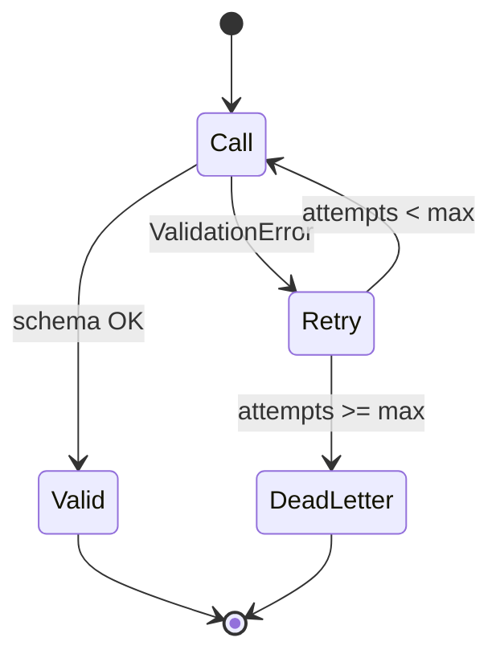

# Instructor — quick start

> **Visual study guide** · Course 0 · Read · Primary: [python.useinstructor.com ↗](https://python.useinstructor.com/)

## What Instructor adds

**Pydantic** defines the shape. **Instructor** forces the LLM to fill that shape—or retry until validation passes (within your limits).

Without Instructor you manually: call API → parse JSON → `model_validate` → catch errors → rewrite prompt. Instructor standardizes that loop.

## Architecture in your capstone repo

## Core objects

| Piece | Responsibility |
| --- | --- |
| `BaseModel` | Field types, required vs optional, enums |
| `instructor.patch(...)` | Wrap client; add `response_model` to calls |
| `ValidationError` | Signal to retry or route to HITL |
| Custom validators | Rules JSON shape alone cannot express |

## Retry policy (decide explicitly)

| Policy | When to use |
| --- | --- |
| 2–3 retries with error text | Noisy logs, cheap model |
| 0 retries, fail fast | High-stakes finance rows |
| Repair prompt | Missing optional fields only |

## Read path for this topic

1. Quick start — minimal `response_model` example.
2. Retries — how validation errors feed the next attempt.
3. Partial / streaming — **defer** until Month 1 build unless syllabus asks.

## Failure modes

- **Silent coercion** — using loose parsing; always prefer strict models.
- **Giant schemas** — every field in the tool schema burns tokens; start minimal.
- **Retries without metrics** — you cannot tune cost if retry rate is invisible.

## Metrics to log

- `schema_validation_pass_rate`
- `retry_count_per_record`
- `usd_per_successful_extraction`
- `validation_error_code` (taxonomy: missing field, wrong enum, invariant)

## Done when

You can implement `extract(text) -> LogEvent` with Instructor + explicit `ValidationError` handling and one pytest on a golden row.

## Primary source

[Instructor documentation ↗](https://python.useinstructor.com/) — shared across multiple syllabus topics; finish **quick start + retries** for this checkbox only.
