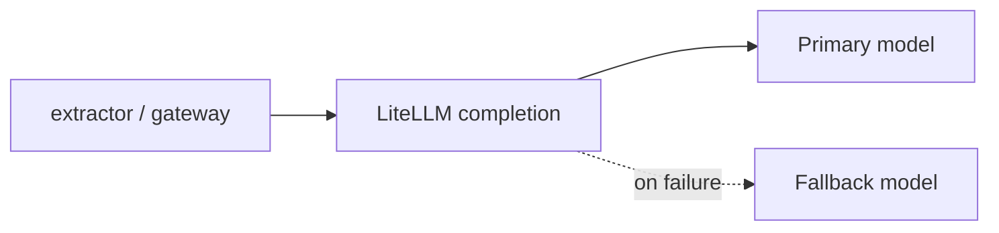

# LiteLLM — reliable completions & fallbacks

> **Visual study guide** · Course 0 · Read · [LiteLLM reliable completions ↗](https://docs.litellm.ai/docs/completion/reliable_completions)

## What you are learning

LiteLLM is the **gateway adapter**: one Python call shape, many providers, with retries, fallbacks, and timeouts you can test like any other service boundary.

| Knob | Plain English | Platform lever |
| --- | --- | --- |
| **Fallbacks** | If model A fails, try B | Avoid single-vendor outage |
| **Retries** | Transient 429/5xx | Backoff + cap spend |
| **Timeout** | Hard stop on hung calls | Protect worker pools |
| **Routing** | Pick model by policy | Same as env-specific endpoints in DE |

## Month 0 → Month 1 bridge

You read this before the v0.2 gateway prove: every extraction call should go through **one** LiteLLM entrypoint with logged `model`, `latency_ms`, and `fallback_used`.

## Done when

You can explain one production incident prevented by fallbacks (even a tabletop story tied to your README).
