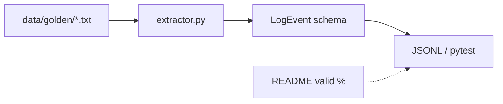

# Build — public log reconciler

> **Lab & Prove** companion · Course 0 · Synthetic data only

## DE scenario

Pipeline logs land as **raw text**; bronze needs **typed records**. You ship a small Python service with golden-set regression—same contract mindset as a parser before dbt.

## Prove checklist

| Artifact | Why it matters |
| --- | --- |
| Public GitHub repo | Portfolio + reproducibility |
| `data/golden/` | Fixture discipline like dbt seeds |
| `pytest` green | CI-ready from day one |
| README metric | Interviewers reproduce in &lt;10 min |

Use **Lab & Prove** code blocks for `models/log_event.py`, `extractor.py`, and `tests/test_golden.py`.
