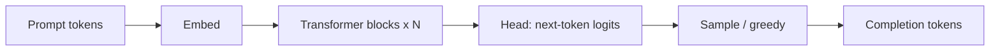

# Karpathy — Deep Dive into LLMs

> **Foundations** — read this page **before** the ~3 h lecture. When the **Ready for the lecture** checklist below is true, open the **Lecture** tab.

## What you are learning (transformers, without the math exam)

Modern chat models are **decoder-only transformers**. You do not need to derive backprop; you **do** need a picture of what scales with prompt length, batch size, and model size—because that is what your **gateway bills and SLOs** measure.

| Piece | Plain English | Platform lever |
| --- | --- | --- |
| **Token** | Smallest unit the model reads/writes | Cost, context limit, log truncation |
| **Transformer block** | Stack of layers that mix information across positions | Model quality vs latency tradeoff |
| **Self-attention** | Each token “looks at” other tokens with learned weights | Long prompts cost more (quadratic in naive form) |
| **KV cache** | Store past key/value vectors during generation | Faster token 2…N; memory grows with context |
| **Sampling** | How the next token is picked (temperature, top-p) | Low temp for extraction; higher for brainstorming |

## Mental model: one forward pass

- **Prefill** — process the prompt (often drives **TTFT**).
- **Decode** — generate one token at a time; **KV cache** avoids recomputing the whole prompt every step.

## What grows cost and latency

| Knob | Typical effect |
| --- | --- |
| Longer prompt | More prefill work → higher TTFT and prompt tokens |
| Longer completion | More decode steps → more completion tokens |
| Larger model | Higher quality, higher $/token and latency |
| Bigger batch (server-side) | Better throughput; not your problem until self-hosting |

For **structured extraction**, bias to **short JSON outputs** and **low temperature**—you are not optimizing GPU kernels in Month 1; you are optimizing **token volume and validation**.

## Words you will hear in the lecture

- **Inference** — running weights to produce text (your daily job).
- **Context window** — max tokens in one request (prompt + completion).
- **TTFT** — time until the first output token (like TTFB on an API).
- **Hallucination** — fluent wrong text (like a plausible bad join).

## Ready for the lecture when

You can answer **without slides**:

1. What is the difference between **prefill** and **decode**?
2. Why does a **long prompt** hit cost and TTFT before you generate a single answer token?
3. What is **KV cache** for in one sentence?

## After the lecture

Log one real CLI call: `prompt_tokens`, `completion_tokens`, wall-clock ms, and one sentence tying latency to token counts. That feeds Course 1 prove (`v0.2` metrics table).
