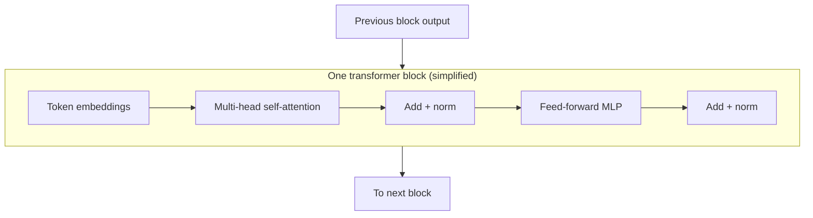
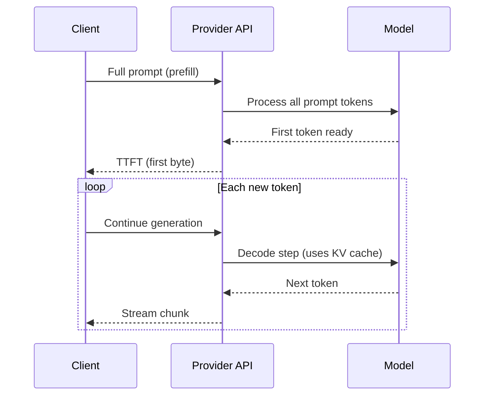

# Karpathy — Deep Dive into LLMs

> **Visual study guide** · Course 1 · ~3 h · Read **Foundations** first, then this page, then the **Lecture** tab.

## Transformer stack (high level)

**Decoder-only (GPT-style)** models use this stack to predict the **next token** autoregressively. Your platform wraps the API that runs this stack—you own schemas, budgets, and evals around it.

## Prefill vs decode (why TTFT ≠ tokens/sec)

| Phase | What happens | What you log |
| --- | --- | --- |
| Prefill | Entire prompt through the stack | `prompt_tokens`, prefill latency |
| Decode | One token per step with cache | `completion_tokens`, inter-token latency |

## KV cache intuition

Without cache, each new token would re-attend over **all** prior tokens from scratch. **KV cache** stores attention keys/values for past tokens so decode steps reuse work—faster generation, **more GPU memory** as context grows.

Platform takeaway: **very long chats or huge RAG dumps** are not “free context”—they are memory and money.

## Sampling knobs (production defaults)

| Parameter | Low value | High value |
| --- | --- | --- |
| **Temperature** | Deterministic extraction | Creative variation |
| **Top-p** | Narrow token choices | Broader, riskier completions |

For your reconciler: **low temperature**, tight **max_tokens**, **Pydantic validation** after the call.

## Watch-for checklist (during the video)

- [ ] Transformer block diagram (attention + MLP)
- [ ] Where weights live vs what runs at inference
- [ ] Why context length limits exist
- [ ] How chat templates / tokenization affect the prompt you send
- [ ] One failure mode you will guard with tests (not prompts alone)

## Capstone hook (Course 1)

Add a README row from a real LiteLLM call:

| Field | Example |
| --- | --- |
| model | `gpt-4o-mini` |
| prompt_tokens | 412 |
| completion_tokens | 89 |
| latency_ms | 1240 |
| usd | 0.00031 |

**Done when:** one paragraph relates P99 latency to token volume for your use case.
