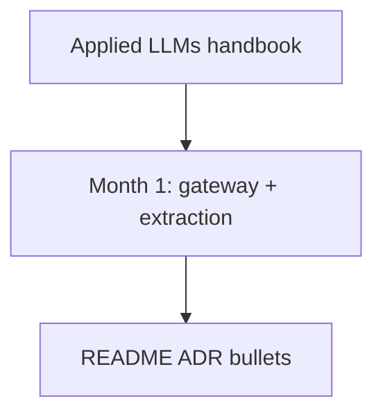

# Applied LLMs — 3+ sections (Month 1)

> **Visual study guide** · Course 1 · Read · [Applied LLMs — tactical ↗](https://applied-llms.org/#toc-tactical-nuts-bolts-of-working-with-llms)

## What you are learning

This is a **map read**, not a novel. Pick three sections that change your v0.2 gateway PR: structured I/O, eval hooks, or observability fields.

| Section family | Month 1 use |
| --- | --- |
| **Prompting / structured I/O** | Align with Instructor + Pydantic |
| **Workflows** | Preview LangGraph (Course 2) |
| **Eval & monitoring** | Preview golden set (Course 7) |

## Time-box

90 minutes reading + 30 minutes writing **three ADR bullets** linked to files in your repo.

## Done when

Each bullet names a pattern you **adopted** or **deferred** with a one-line reason.
