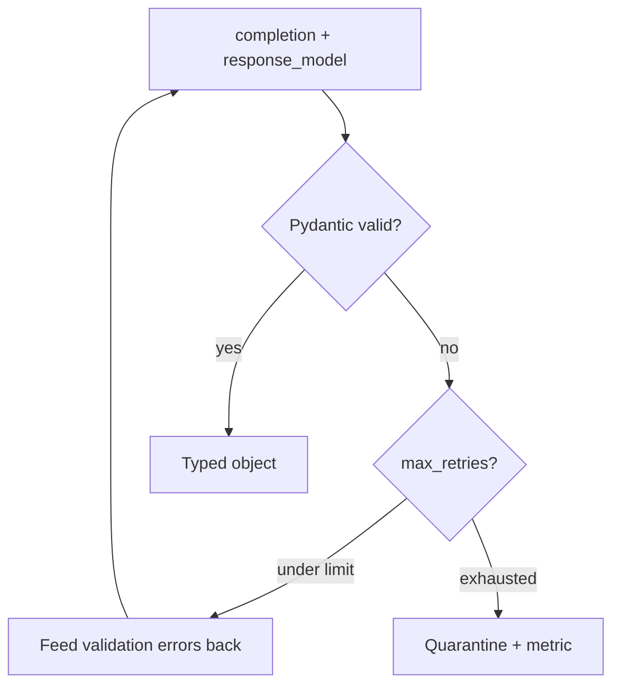

# Instructor — patterns & retries

> **Visual study guide** · Course 1 · Read · [Instructor retries ↗](https://python.useinstructor.com/concepts/retries)

## What you are learning

Quick start taught the loop; this topic standardizes **retry policy** and **error taxonomy** behind LiteLLM.

## Patterns to adopt in v0.2

- **Same schema** for boot-week `LogEvent` and Month 1 services (no forked models).
- **Structured logs** on `ValidationError` with field path—not raw prompt text.
- **Deterministic tests** with mocked client; no live API in CI.

## Done when

`extract()` documents `max_retries`, failure metric, and one test that asserts repair is invoked.
