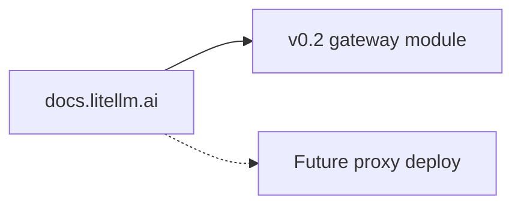

# LiteLLM docs hub

> **Visual study guide** · Course 1 · Read · [LiteLLM docs ↗](https://docs.litellm.ai/docs/)

## What you are learning

Use the docs as a **catalog**, not a linear book. Month 1 needs: completions, reliable routing, and the path to proxy deploy (Month 11).

| Doc area | When to open it |
| --- | --- |
| **Completion** | Gateway `completion()` wiring |
| **Reliable completions** | Fallbacks (Course 0 read) |
| **Proxy** | Later Helm prove — skim headings only |
| **Observability** | Custom callbacks before Langfuse month |

## Done when

README lists three doc URLs you used this month and the config keys they map to in your repo.
