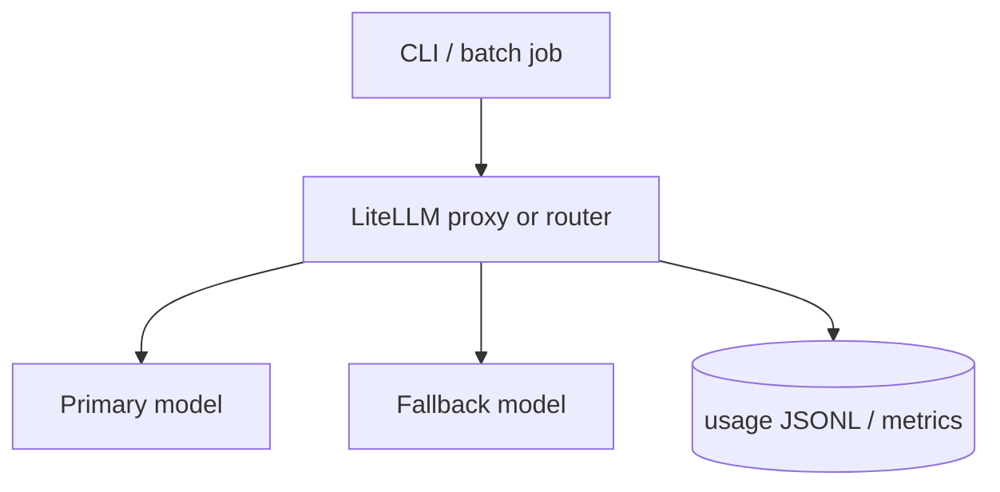

# Build — LiteLLM router + per-request cost log

## Platform picture

## DE scenario

Every LLM step in your pipelines should emit **job_id**, **tokens**, **latency_ms**, and **model id**—joinable to Airflow `dag_run_id` or Glue `job_run_id` in a real org.

**Prove:** Git tag `v0.2` + README table (see Lab tab snippets).
