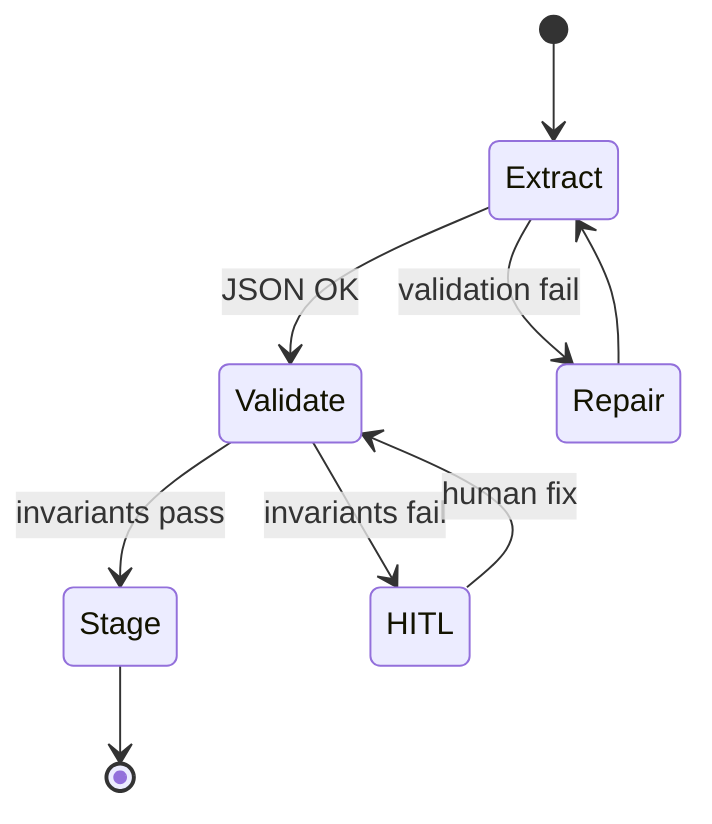
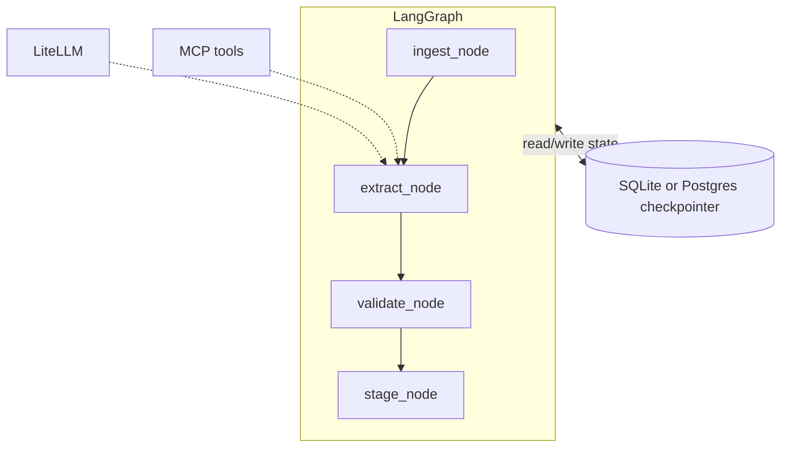
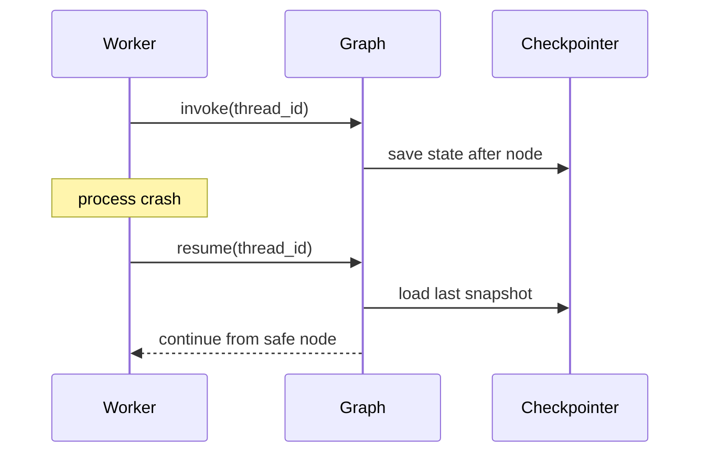

# AI Agents in LangGraph

> **Visual study guide** · Course 2 · Video · [DL.AI short course ↗](https://www.deeplearning.ai/short-courses/ai-agents-in-langgraph/)

## From one-shot extraction to a state machine

Month 1 treated the LLM as a **single function call**. Month 2 introduces **graphs**: nodes (steps), edges (transitions), and **persistent state** so runs can pause, resume, and survive failures.

## LangGraph vocabulary

| Term | Meaning | Data-engineering analogy |
| --- | --- | --- |
| **State** | Typed dict carried through the graph | Pipeline run context |
| **Node** | Function that updates state | Task / operator |
| **Edge** | Allowed transition | DAG dependency |
| **Checkpoint** | Persisted state snapshot | Idempotent checkpoint / saga |
| **Interrupt** | Pause for human input | Approval step in Airflow |

## reconciler-agent architecture (your prove target)

## Checkpointing: why it matters

- **SQLite** — local dev, single worker.
- **Postgres** — shared state for multiple workers (your production path).

## While you watch the course

- [ ] Map each DL.AI module to a **node** in your graph diagram.
- [ ] Note where **tools** are bound vs where **state** is updated.
- [ ] Identify the **interrupt** pattern for HITL (Month 10 capstone preview).
- [ ] List what you will persist in checkpoint tables (thread id, step, payload hash).

## MCP + LangGraph (preview of Course 3)

Tools should not be ad-hoc HTTP calls inside nodes—prefer **MCP** with audit logs (next month). For now, stub tools with clear interfaces.

## Failure modes

| Risk | Mitigation |
| --- | --- |
| God-node graph | One node does everything—split by responsibility |
| No checkpoint | Cannot resume long runs |
| Unbounded loops | Max steps / cycle detection |
| Side effects before validate | Stage only after invariants pass |

## Done when

You can whiteboard **states, nodes, checkpoints, and one interrupt path** for `reconciler-agent` and explain why SQLite is not enough for multi-worker prod.

## Primary source

[AI Agents in LangGraph ↗](https://www.deeplearning.ai/short-courses/ai-agents-in-langgraph/) — complete modules that match **this** syllabus line, not the entire LangChain catalog.
