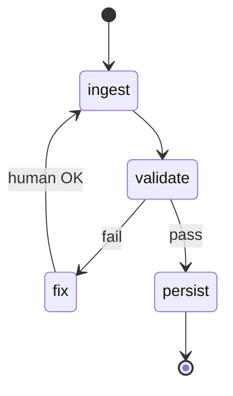

# LangGraph documentation

> **Visual study guide** · Course 2 · Read · [Why LangGraph ↗](https://langchain-ai.github.io/langgraph/concepts/why-langgraph/)

## What you are learning

LangGraph models your reconciler as a **state machine**: nodes, edges, checkpoints, and human interrupts—not a single while-loop script.

| Concept | DE analogy |
| --- | --- |
| **State** | Pipeline context object / run metadata |
| **Checkpoint** | Idempotent stage table |
| **Interrupt** | Manual approval queue |
| **Node** | One transformation step |

## Done when

Your README diagram labels graph nodes that match real Python entrypoints in `reconciler-agent`.
