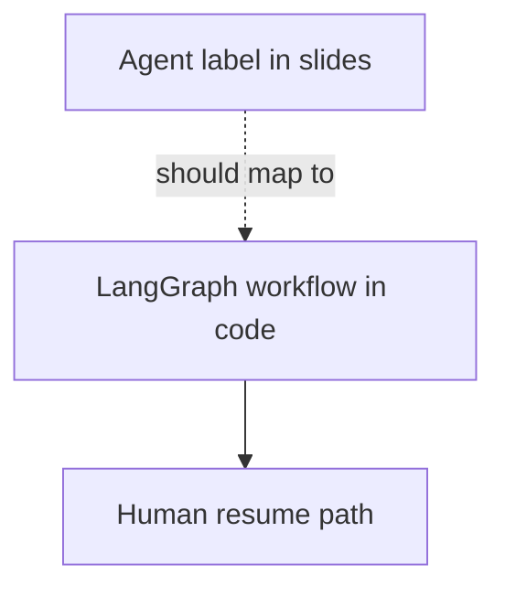

# Applied LLMs — agents / orchestration

> **Visual study guide** · Course 2 · Read · [Multi-turn flows ↗](https://applied-llms.org/#toc-step-by-step-multi-turn-flows-can-give-large-boosts)

## What you are learning

Agents here means **orchestrated steps with state**, not autonomous open-ended loops. Align handbook language with your LangGraph HITL design.

| Handbook idea | Your prove artifact |
| --- | --- |
| **Deterministic workflows first** | Graph before “agent” branding |
| **Multi-turn flows** | Validate → repair → resume |
| **Human in the loop** | `interrupt()` on validation fail |

## Done when

ADR states one handbook pattern you implemented vs deferred, with a link to the graph module.
