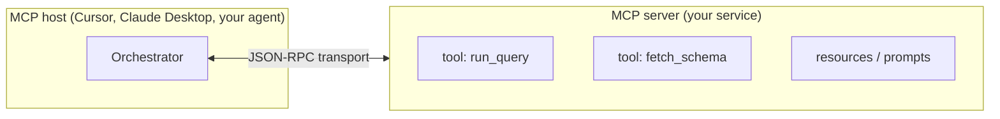
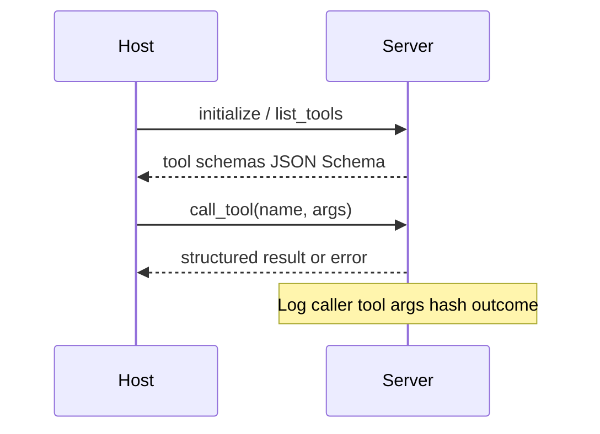
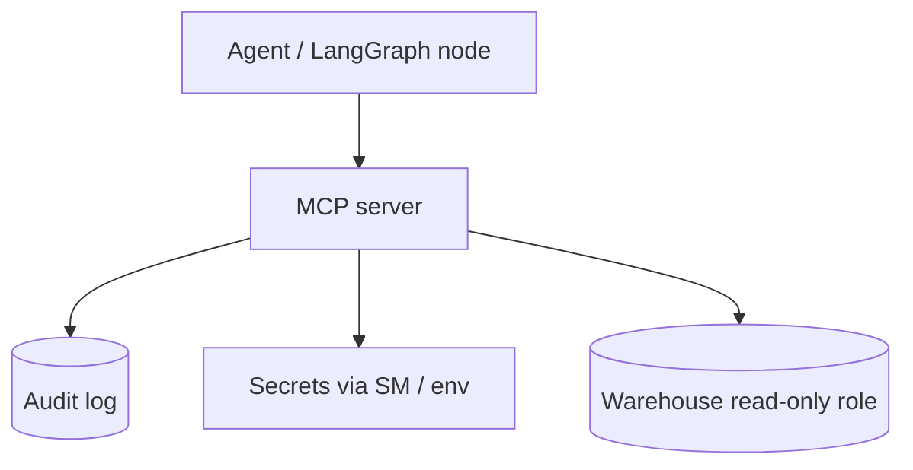

# MCP introduction

> **Visual study guide** · Course 3 · Read · [modelcontextprotocol.io ↗](https://modelcontextprotocol.io/introduction)

## Problem MCP solves

Agents need **tools** (query warehouse, run job, read ticket). Without a standard, every host invents its own plugin format. **Model Context Protocol (MCP)** defines how a **host** discovers and calls **tools** on a **server**—with schemas, auth boundaries, and audit-friendly requests.

## Roles (memorize these)

| Role | Owns |
| --- | --- |
| **Host** | User session, model, when to call tools |
| **Client** | Connection from host to server (often embedded in host) |
| **Server** | Exposes tools/resources; enforces authz |

You will **build servers** and **consume** them from LangGraph nodes—not reimplement MCP inside every tool.

## Request lifecycle

## Security architecture for Month 3 prove

Prove gate deliverables:

- README describing **tools**, **auth**, and **redacted** client config.
- No secrets in git—sample env only.

## How MCP relates to FastMCP (next reads)

| Layer | You learn |
| --- | --- |
| Spec (this topic) | Wire format, capabilities, transports |
| FastMCP | Python ergonomics to implement servers quickly |
| Your graph | Calls MCP instead of raw SQL in prompt text |

## Read checklist (official intro)

- [ ] Client vs server responsibilities
- [ ] Tool schema discovery (`list_tools`)
- [ ] Transports overview (stdio vs HTTP)—pick one for prove
- [ ] Resources vs tools vs prompts (don’t conflate)

## Failure modes

- **Tools without authz** — equivalent to public SQL endpoint.
- **Secrets in repo** — use redacted snippets in prove README only.
- **Unlogged tool calls** — compliance nightmare; append-only audit from day one.
- **Giant tool outputs** — truncate / paginate before model context.

## Done when

You can diagram **host → MCP server → backing system** and list three fields you log per `call_tool`.

## Primary source

[MCP introduction ↗](https://modelcontextprotocol.io/introduction) then [specification ↗](https://modelcontextprotocol.io/docs) for depth as needed.
