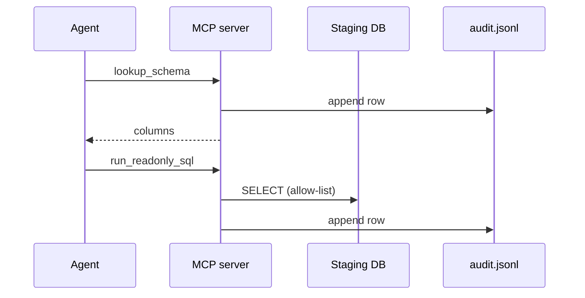

# Build — MCP tools with audit trail

## DE scenario

Replace “paste SQL into ChatGPT” with **allow-listed tools** and an **append-only audit log**—same compliance story as logged stored procedures.

Implement: `lookup_schema`, `query_golden_set`, `run_readonly_sql` (see Lab code card).
