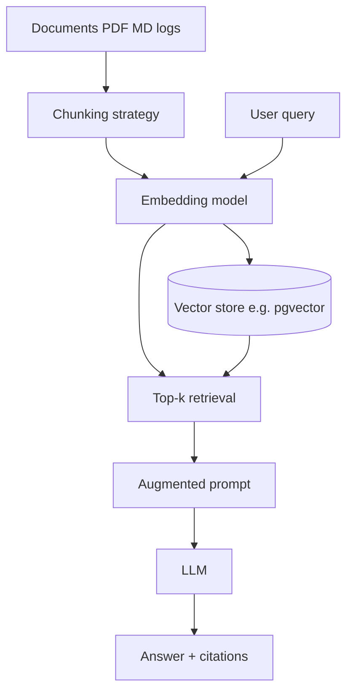
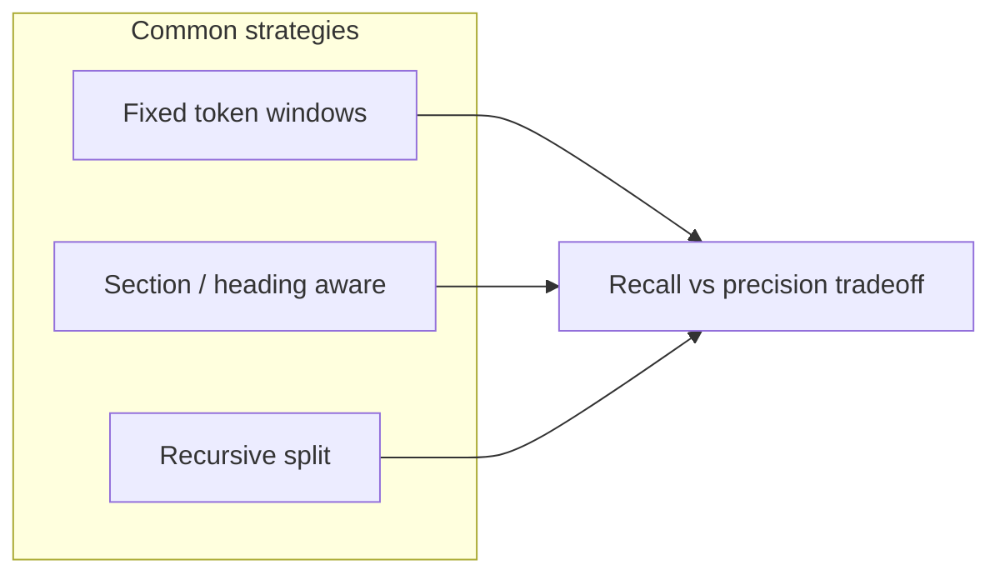
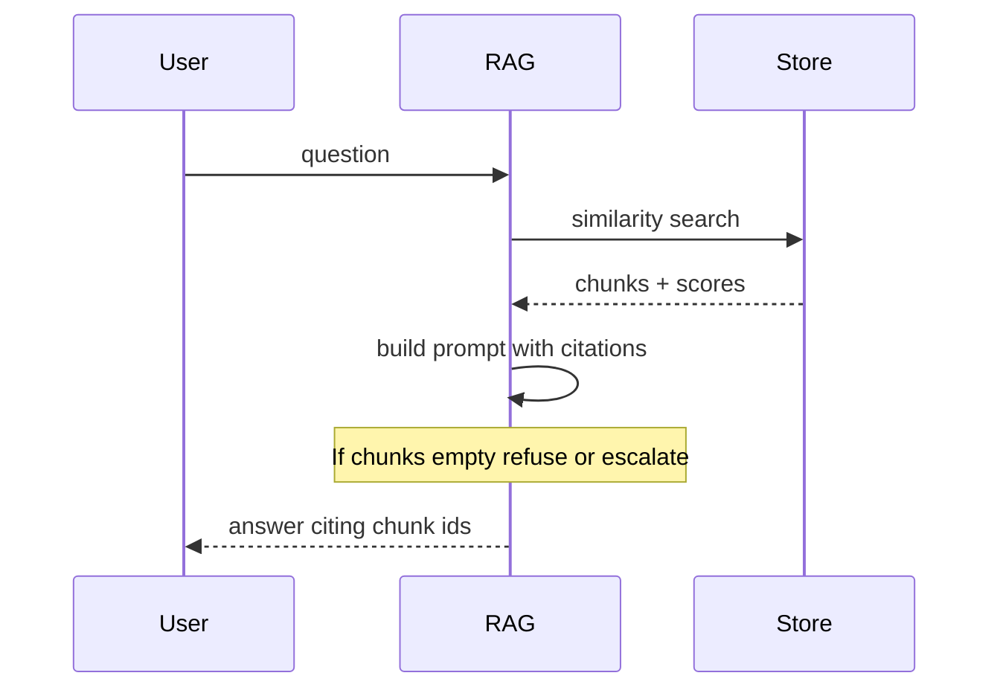
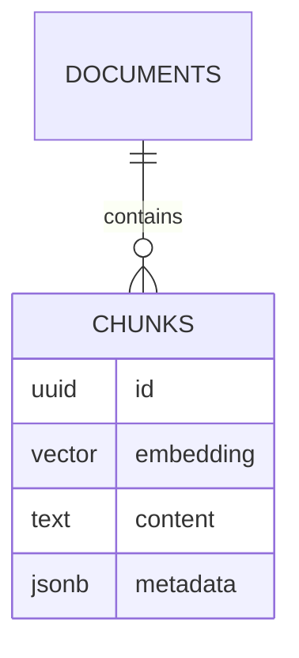

# Document Chat RAG walkthrough

> **Visual study guide** · Course 4 · Video · [YouTube walkthrough ↗](https://www.youtube.com/watch?v=zgnjMWipirk)

## What RAG is (one sentence)

**Retrieval-augmented generation**: fetch relevant chunks from a corpus, inject them into the prompt, then ask the model to answer **grounded in those chunks**—not from parametric memory alone.

Data-engineering analogy: **join to a reference table** before computing a metric.

## End-to-end RAG pipeline

## Chunking is a data modeling choice

| Strategy | Pros | Cons |
| --- | --- | --- |
| Fixed size | Simple | Splits tables / code badly |
| Heading-aware | Better docs | Needs structure metadata |
| Overlap windows | Higher recall | More storage & cost |

## Retrieval quality levers

- **Embedding model** — domain fit beats random OpenAI default for specialized logs.
- **k** — too few misses context; too many dilutes prompt.
- **Metadata filters** — tenant, date, source system (like partition pruning).
- **Hybrid** — BM25 + vectors for keyword-heavy queries (Month 4+ reads).

## Grounding and hallucination

**Fail closed** when retrieval returns nothing relevant—do not let the model freestyle.

## While you watch

- [ ] Note **chunk size** and **overlap** used in the demo.
- [ ] Identify where **embeddings** are created vs queried.
- [ ] List what you would log: query, k, chunk ids, scores, model id.
- [ ] Sketch how pgvector fits your capstone (table DDL, index).

## Connect to pgvector prove (next reads)

## Failure modes

| Issue | Signal | Fix |
| --- | --- | --- |
| Stale index | Wrong doc version answers | Version source docs; re-embed on change |
| Chunk too large | Truncated context | Smaller chunks + parent retrieval |
| No citations | Untraceable answers | Require chunk ids in output schema |
| Injection via docs | Malicious corpus text | Sanitize sources; separate trust zones |

## Done when

You can draw **ingest → chunk → embed → store → retrieve → prompt → answer** and name one metric you will use in Month 7 eval (e.g. context precision).

## Primary source

[Document Chat RAG walkthrough ↗](https://www.youtube.com/watch?v=zgnjMWipirk) — then implement the pattern in your repo with **pgvector** per Course 4 build/prove items.
