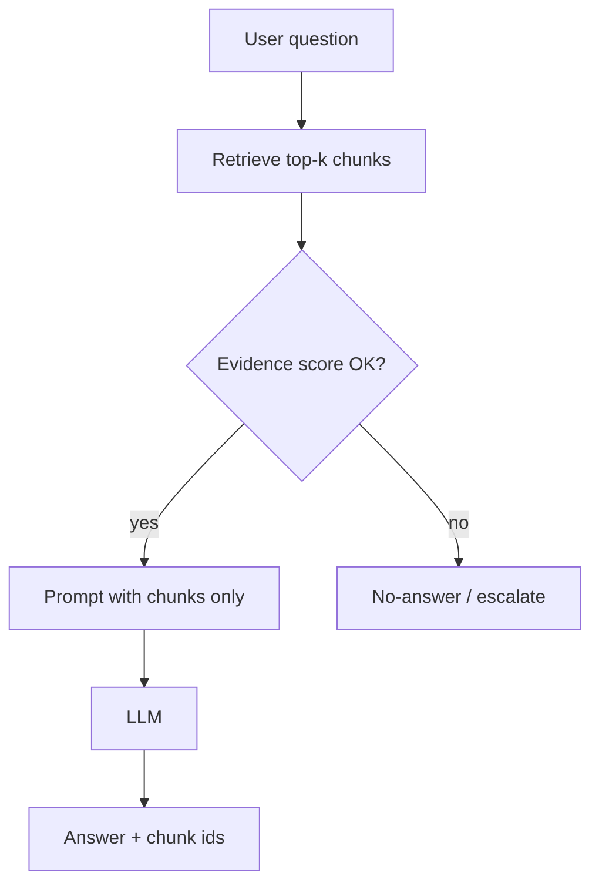

# Applied LLMs — retrieval & grounding

> **Visual study guide** · Course 4 · Read · [Applied LLMs ↗](https://applied-llms.org/)

## What you are learning

Retrieval is not “install a vector DB.” It is a **measured join** between a user question and **evidence chunks** before the model answers. Your platform owns chunk quality, index freshness, fusion strategy, and **when not to answer**.

| Idea | Plain English | Platform lever |
| --- | --- | --- |
| **Grounding** | Answer must cite retrieved chunks | Force citations or “insufficient context” path |
| **Recall@k** | Did the right chunk appear in top-k? | Regression dataset like SQL golden queries |
| **Precision** | Are top-k chunks mostly relevant? | Tune chunk size and metadata filters |
| **No-answer** | Refuse when evidence is weak | Prevents confident hallucination in prod |
| **Hybrid** | Dense + sparse (BM25) fusion | Ops knob—document when you disable either leg |

## Grounding flow (your Month 4 prove mindset)

Data-engineering analogy: **inner join** to a staging table of chunks—if the join is empty, you do not fabricate metrics.

## Failure modes (design for these in Course 4)

- **Stale index** — documents updated but embeddings not rebuilt; answers cite old policy.
- **Chunk boundary bugs** — table split across chunks; retrieval misses critical rows.
- **Dense-only on keyword-heavy queries** — SKUs, error codes, and ticket IDs need sparse search.
- **No citation discipline** — model improvises beyond retrieved text.
- **Benchmark theater** — one-off demo query set, not committed `benchmarks/*.json`.

## Tie-in to hybrid prove (orders 55–57)

You already have a **visual guide on hybrid benchmarks**. This reading supplies vocabulary: when RAG helps, when it hurts, and how to report **dense vs hybrid** on the same labeled Q/A set.

**Done when:** You can explain one labeled question where hybrid beats dense-only—and one where it does not.
