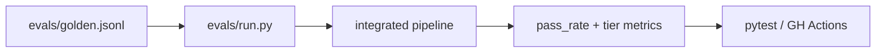

# Build — `evals/golden.jsonl` + runner

> **Lab & Prove** companion · Course 7 · Treat LLM outputs like dbt tests

## DE scenario

Before any prompt or router change merges, run labeled rows through your **production path** (extractor, RAG, or graph node). Record **pass rate**, **field-level mismatches**, and **cost/latency**—the same bar you use for row-count and schema tests on bronze.

## Prove checklist

| Artifact | Why it matters |
| --- | --- |
| n≥30 golden rows in git | Statistical signal, not vibes |
| Tier 1/2 metrics in README | Interviewers see what you optimize |
| `pytest` or `evals/run --fail-on-regression` | Merge gate like data quality |

Use **Lab & Prove** for the golden row format and `evals/run.py` starter.
