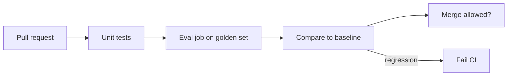

# DeepEval — CI/CD evaluation gates

> **Visual study guide** · Course 8 · Read · [DeepEval end-to-end CI/CD ↗](https://docs.confident-ai.com/docs/evaluation-end-to-end-ci-cd)

## What you are learning

Course 7 gave you a **golden set and harness**. Course 8 makes evals a **merge gate**—the same muscle as data-quality tests blocking a bad warehouse deploy.

| Layer | What it catches | DE analogy |
| --- | --- | --- |
| **Tier 0** | Schema / JSON shape | Column type constraints |
| **Tier 1** | Retrieval hit / required fields | Row count + key uniqueness |
| **Tier 2** | Semantic metrics (faithfulness, etc.) | Business rule SQL on outputs |
| **Baseline** | Drift vs last good run | Snapshot diff in CI |

## What to commit in your repo (Build order 82)

- `.github/workflows/evals.yml` — runs on PR with pinned Python + deps.
- `evals/baseline.json` or committed metric summary — **not** a screenshot alone.
- Non-zero exit when regression exceeds your documented epsilon.

## Prove row 83 (what “good” looks like)

A reviewer clones your repo, opens a **failed** or **passed** PR (or workflow run) and sees:

1. Which metric moved.
2. Which golden cases regressed (paths or ids).
3. How to refresh baseline with team review—not silent overwrite.

## Platform judgment

- **Flaky LLM evals** — fix temperature, seed, and model version in workflow env.
- **CI cost** — subset smoke on every PR; full golden set on `main` or nightly.
- **Alert fatigue** — one composite gate, not ten conflicting thresholds.

**Staff-engineer one-liner:** “We treat prompt changes like schema migrations—CI must show the golden set diff.”
