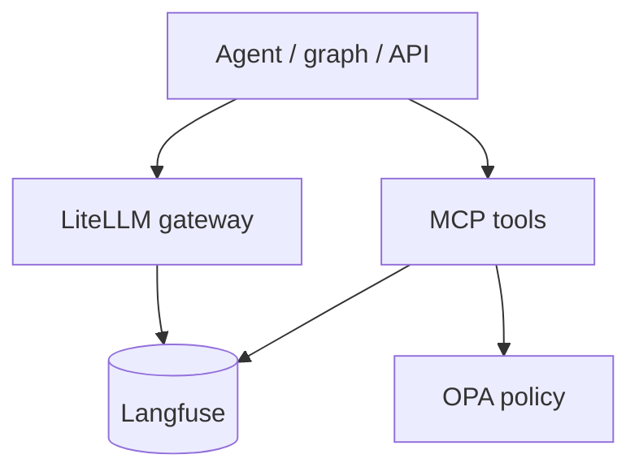

# LiteLLM — Langfuse integration

> **Visual study guide** · Course 9 · Read · [Langfuse integration ↗](https://docs.litellm.ai/docs/observability/langfuse_integration)

## What you are learning

Month 9 connects **policy** (OPA) and **traces** (Langfuse / OTel). LiteLLM is the choke point where every model call should emit **cost, latency, and trace ids** your SRE team can search.

| Field | Why it matters |
| --- | --- |
| `trace_id` / `session_id` | Correlate user → model → tool |
| `model`, `fallback_model` | Debug quality swaps |
| `prompt_tokens`, `completion_tokens` | FinOps and chargeback |
| `metadata.job_id` | Join to batch pipeline run |

## Platform extension path (optional depth)

If you are pursuing the **platform extension** checklist in the program brief, this topic is where **multi-tenant metadata** starts:

- Per-app `metadata.tenant` or `user_id` on every `completion`.
- Deny path logs an **audit event** (who, what model, why blocked)—not only HTTP 403.
- Same trace conventions for **MCP tool calls** (order 92 build).

## Build + prove linkage

- **Build 92** — wire LangGraph nodes and LiteLLM through Langfuse.
- **Prove 93** — redacted trace screenshot + `opa test` (or equivalent) output.

**Done when:** One end-to-end trace shows gateway call → graph step → tool invocation with shared trace id.
