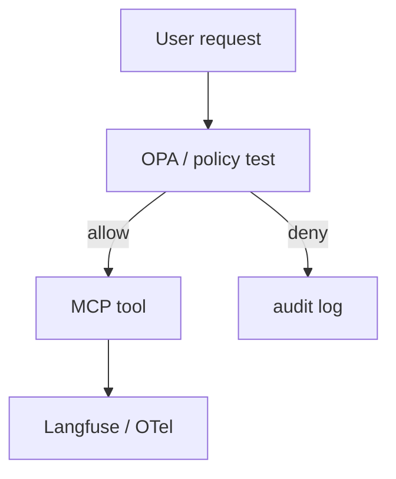

# Build — OPA + Langfuse / OpenTelemetry

> **Lab & Prove** companion · Course 9 · Same discipline as IAM + pipeline lineage

## DE scenario

An agent must not call **write** tools for read-only roles. **Policy** evaluates tool args before execution; **traces** tie `run_id` to gateway, graph, and tool spans—like CloudTrail plus Airflow task logs when debugging a failed DAG.

## Prove checklist

| Artifact | Why it matters |
| --- | --- |
| `opa test` or unit policy test | Deny dangerous patterns in CI |
| Trace screenshot with `run_id` | Reproduce one alpha path end-to-end |

Use **Lab & Prove** for Rego sketch and trace expectations.
