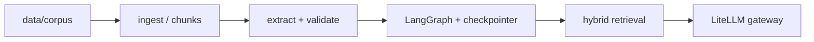

# Capstone — ingestion + platform spine

> **Lab & Prove** companion · Course 10 · **Wire** track · Read `docs/capstone_product_brief.md` first

## DE scenario

**OpsLedger AI** turns synthetic ops text into typed records with HITL and measured retrieval. Month 10 is **integration**, not new frameworks: connect Course 0–9 modules behind one API and one demo command.

## Prove checklist

| Artifact | Why it matters |
| --- | --- |
| Git tag `alpha` | Frozen integration point |
| `make demo` or `docker compose up` | Reviewer reproduces in &lt;10 min |
| Caching table (≥10 requests) | TTFT + cached vs uncached tokens |

Follow **capstone scope** pills in the syllabus: **Wire**, **Caching**, **Demo**, **Reference**, **Defer**.
