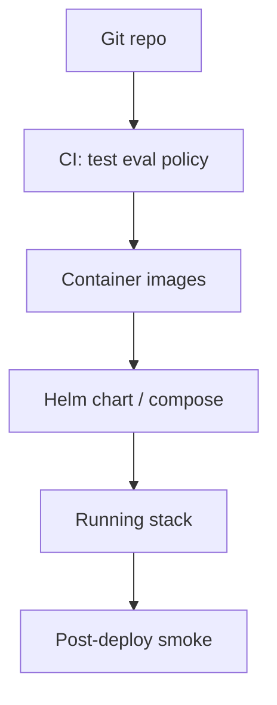

# Build — Helm chart or Docker Compose deploy

> **Visual study guide** · Course 11 · Build · Docs: [LiteLLM proxy deploy ↗](https://docs.litellm.ai/docs/proxy/deploy) · [Helm quickstart ↗](https://helm.sh/docs/intro/quickstart/)

## What you are learning

Course 11 proves you can **ship** the platform—not only run it on a laptop. Compose is fine for demos; Helm (or your org’s equivalent) is how teams promote **the same chart** from staging to production.

| Artifact | Purpose |
| --- | --- |
| `DEPLOY.md` | One-command bring-up + rollback |
| `docs/adding-a-tool.md` | Platform UX—how another dev extends safely |
| Health checks | Proxy liveness, not only “container running” |
| Secrets | Provider keys via env/secret store—never in git |

## DE analogies

- **Compose file** = docker-compose for a small data stack—explicit service boundaries.
- **Helm values** = environment-specific tfvars—same chart, different limits and routes.
- **Smoke tests** = post-deploy DQ checks—run eval subset + policy test after rollout.

## Executable deploy prove (Course 11 rubric)

Your prove pack expects evidence a reviewer can replay:

1. Documented install command (`helm upgrade` or `docker compose up`).
2. Smoke: health endpoint + **one** eval or policy check against the deployed URL.
3. Rollback steps (previous chart revision or compose down + prior tag).

## Platform extension: IaC deploy

For **platform extension** graduates, this month is the anchor for **IaC deploy** prove: PR updates staging, pipeline runs tests, and `DEPLOY.md` names the promotion path—not “I clicked deploy in a UI once.”

**Watch for:** Gateway up but **Langfuse/OPA not wired** in the deployed profile—trace and policy must match local dev.
