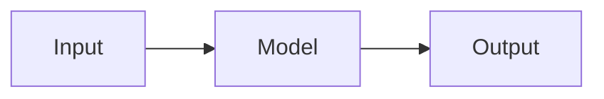

# Studio visual theory guides

Authored topic pages (diagrams, architecture, checklists) that replace the auto-generated **Study guide** for specific lessons.

## File naming

| Pattern | Role |
| --- | --- |
| `{order:03d}-{slug}.studio.md` | **Visual guide** (intermediate level) — main content |
| `{order:03d}-{slug}.beginner.md` | Optional override for Foundations |
| `{order:03d}-{slug}.advanced.md` | Optional override for Platform depth |

`order` must match `lesson.order` in `data/lessons.json` (syllabus topic number).

Optional YAML frontmatter (ignored today, reserved for metadata):

```yaml
---
title: Human title
---
```

## Diagrams

Use fenced **mermaid** blocks. They render in the Overview tab when **Visual guide** is selected.



## Build pipeline

```bash
python3 scripts/generate_lessons.py
# or
npm run curriculum
```

Sets `theory_studio_guide: true` on lessons with a `.studio.md` file.

## Regenerate vs studio guide

Learners can still use **Regenerate theory** in the mentor panel; that AI output replaces the view until cleared. Studio guides remain the default curriculum.

## Adding topics

1. Pick `order` from the sidebar topic number.
2. Add `docs/topic_theory/NNN-short-slug.studio.md`.
3. Add or extend **`data/lab_scenarios.json`** (`by_course` + optional `by_order`) for DE scenario text and copy-paste code in **Lab & Prove**.
4. Run `npm run curriculum` and `npm run validate:ci`.

**Visual guides today:** Karpathy intro/deep-dive, Instructor, LangGraph, MCP, document RAG, Course 0/1/3/4 build milestones—add more for any topic where a diagram beats prose alone.
